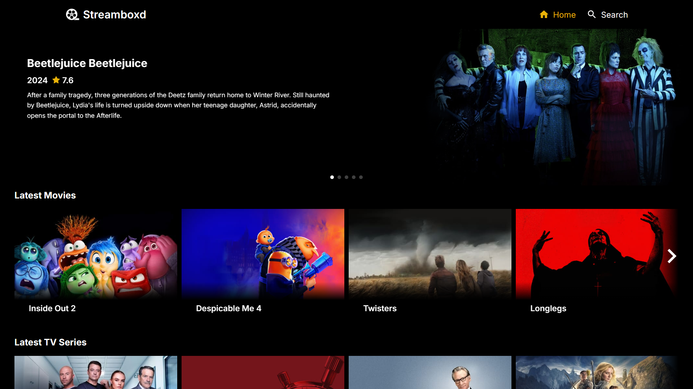
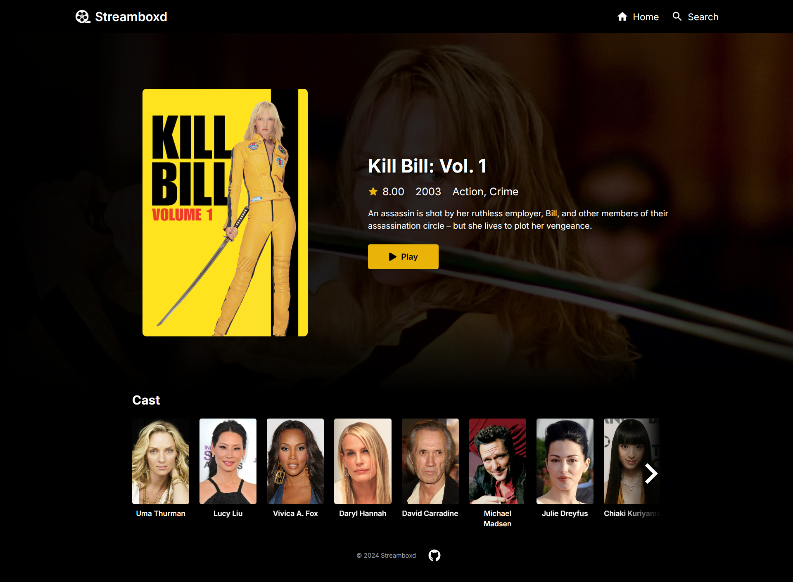
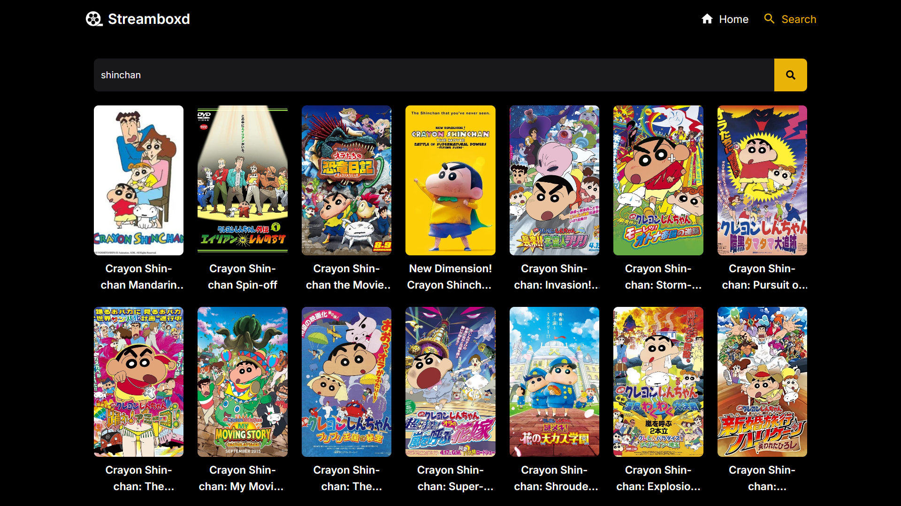

## Streamboxd

An online Movie & TV Show streaming website built with [Next.js](https://nextjs.org), [TypeScript](https://www.typescriptlang.org/), [TMDB Api](https://developer.themoviedb.org/reference/intro/getting-started)





## Getting Started

First, run the development server:

```bash
npm run dev
# or
yarn dev
# or
pnpm dev
# or
bun dev
```

Open [http://localhost:3000](http://localhost:3000) with your browser to see the result.

You can start editing the page by modifying `app/page.tsx`. The page auto-updates as you edit the file.

This project uses [`next/font`](https://nextjs.org/docs/basic-features/font-optimization) to automatically optimize and load Inter, a custom Google Font.
